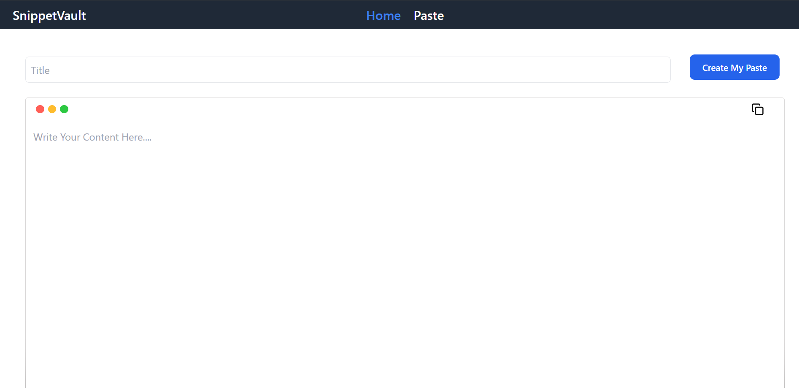
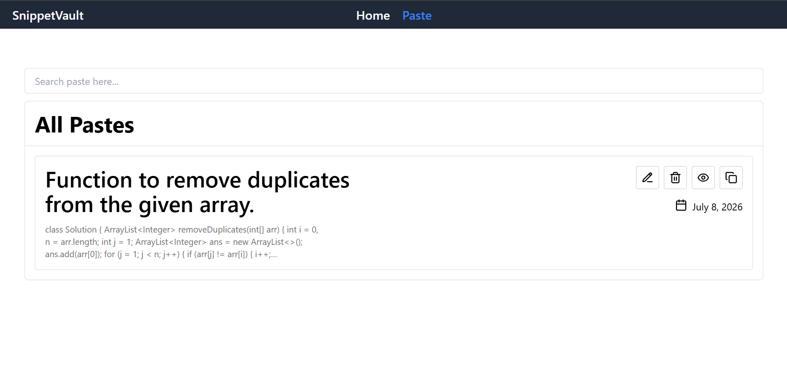

<div align="center">

# 📌 SnippetVault

**Create, organize, and manage reusable text snippets — instantly.**

[](https://react.dev/)
[](https://vitejs.dev/)
[](https://tailwindcss.com/)
[](https://reactrouter.com/)
[]()
[]()
[](LICENSE)

</div>

---

## 🚀 Project Overview

**SnippetVault** is a modern, client-side web application for managing reusable text snippets. It solves a simple but persistent problem — developers and professionals constantly reuse the same blocks of text (code snippets, templates, commands, notes) and need a fast, organized way to store and retrieve them.

Built with **React 18**, **Redux Toolkit**, and **Tailwind CSS**, the app provides full CRUD operations on text pastes with real-time search, clipboard copy, and browser-based persistence via `localStorage`. No backend, no accounts, no setup — just open and start saving.

**Key highlights:**
- Full create, edit, delete, view, search, and copy workflow
- All data persists locally across browser sessions
- Centralized state management with Redux Toolkit
- Clean, responsive UI with macOS-inspired editor aesthetics
- Deployed on Vercel with SPA routing support

---

## 📸 Screenshots

### Home — Create Paste



### Paste Listing — Search & Manage



---

## ✨ Features

| Feature | Description |
|---------|-------------|
| ✅ **Create Paste** | Add new snippets with a title and content body, each assigned a unique ID |
| ✅ **Edit Paste** | Modify existing pastes — the form auto-populates via URL search params |
| ✅ **Delete Paste** | Remove pastes instantly from the store and localStorage |
| ✅ **Search** | Real-time title-based filtering with case-insensitive matching |
| ✅ **Copy to Clipboard** | One-click copy on both the editor and listing pages |
| ✅ **View Paste** | Open any paste in a dedicated read-only view (new tab) |
| ✅ **Local Storage** | All data persists across sessions — no backend required |
| ✅ **Toast Notifications** | Context-aware success/error toasts for every action |
| ✅ **Date Display** | Human-readable creation dates using `Intl.DateTimeFormat` |
| ✅ **Responsive UI** | Adapts between desktop and mobile using Tailwind breakpoints |
| ✅ **SPA Routing** | Client-side navigation with active link highlighting |

---

## 🛠️ Tech Stack

| Layer | Technology | Purpose |
|-------|-----------|---------|
| **Frontend** | React 18.3 | Component-based UI |
| **Styling** | Tailwind CSS 3.4 | Utility-first CSS |
| **Routing** | React Router DOM 6.26 | Client-side SPA routing |
| **State** | Redux Toolkit 2.2 | Centralized state management |
| **Notifications** | React Hot Toast 2.4 | Toast notifications |
| **Icons** | Lucide React 0.445 | Tree-shakable icon set |
| **Storage** | localStorage | Browser-based persistence |
| **Build** | Vite 7.3 | Dev server and bundler |
| **Deployment** | Vercel | Production hosting |

---

## 📁 Project Structure

```
paste-manager-react/
├── public/
│   └── vite.svg
├── src/
│   ├── components/
│   │   ├── Home.jsx            # Create / Edit paste form
│   │   ├── Navbar.jsx          # Navigation bar with branding
│   │   ├── Paste.jsx           # Paste listing, search, and actions
│   │   └── ViewPaste.jsx       # Read-only paste viewer
│   ├── data/
│   │   └── Navbar.js           # Navigation link definitions
│   ├── redux/
│   │   ├── pasteSlice.js       # Redux slice (actions + reducers)
│   │   └── store.js            # Redux store configuration
│   ├── utlis/
│   │   └── formatDate.js       # Date formatting utility
│   ├── App.jsx                 # Route definitions
│   ├── index.css               # Tailwind directives
│   └── main.jsx                # Entry point (Provider + Toaster)
├── index.html
├── package.json
├── tailwind.config.js
├── postcss.config.js
├── vite.config.js
├── vercel.json                 # SPA rewrite rules for Vercel
└── eslint.config.js
```

---

## ⚡ Getting Started

```bash
# Clone the repository
git clone https://github.com/harshpreet284/paste-manager-react.git

# Navigate to the project
cd paste-manager-react

# Install dependencies
npm install

# Start the development server
npm run dev

# Build for production
npm run build
```

The app will be available at `http://localhost:5173`.

---

## 🔄 How It Works

1. Open the app → land on the **Home** page with the paste editor
2. Enter a **title** and **content**, then click **"Create My Paste"**
3. The paste is saved to **Redux** and synced to **localStorage**
4. Navigate to the **Paste** page to view all saved snippets
5. **Search** pastes by title using the search bar
6. Use action buttons to **edit** ✏️, **delete** 🗑️, **view** 👁️, or **copy** 📋 any paste
7. Editing redirects back to Home with pre-filled fields and an **"Update Paste"** button
8. Viewing opens the paste in a **new tab** as a read-only page
9. All changes persist across browser sessions automatically

---

## 🔮 Future Improvements

- ☁️ **Cloud Sync** — Backend integration for cross-device access
- 🔐 **Authentication** — User accounts for personal paste libraries
- 📝 **Rich Text / Markdown** — Syntax highlighting and formatted content
- 🏷️ **Tags & Categories** — Organize pastes with labels and folders
- ⭐ **Favorites** — Pin frequently used snippets
- 📥 **Import / Export** — Download pastes as JSON or bulk import
- 📱 **PWA Support** — Offline access and installability
- 🎨 **Dark Mode** — Theme toggle for comfortable viewing

---

## 👤 Author

| | |
|---|---|
| **Name** | Harshpreet Singh |
| **GitHub** | [@harshpreet284](https://github.com/harshpreet284) |
| **LinkedIn** |(https://www.linkedin.com/in/harshpreet-singh-2909a8294/) |

---

<div align="center">

⭐ **If you found this useful, consider giving it a star!**

</div>
